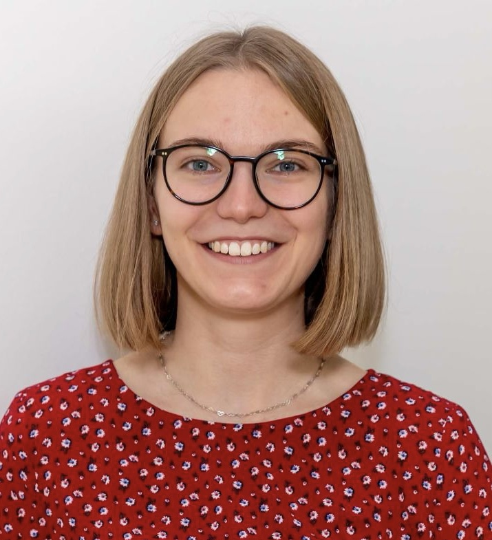

# Dutch Circular Economy PhD Network

Source for the [Dutch CE PhD Network website](https://aymara-wagner.github.io/CE-PhD-Network/), connecting PhD researchers working on the circular economy transition across the Netherlands.

The site is a static HTML/CSS page (`index.html` + `style.css`) served directly by GitHub Pages — no build step. To preview changes locally, open `index.html` in a browser, or run a local server from the repo root, e.g.:

```bash
python -m http.server 4321
```

then visit `http://localhost:4321`.

## Page structure

`index.html` is laid out in eight numbered sections (see the HTML comments): masthead, invitation,
about, what to expect, event, council, contact, footer. "Who are we?" and "What can you expect?"
are two blocks that share the single **About** nav link, so only the first carries `id="about"`.
The supporters/funders line appears in the footer only.

## Updating the Council Members section

Each council member is one `<article class="member">` block in `index.html`, sorted alphabetically
by surname. A complete entry looks like this:

```html
<article class="member">
  
  <h3>Catrin Böcher</h3>
  <div class="member-details">
    <p class="member-role">PhD Candidate</p>
    <p class="member-affil">Institute of Environmental Sciences (CML), Leiden University</p>
  </div>
</article>
```

- **Avatar** — with a photo, use the `` line above; without one, use
  `<div class="avatar avatar-initials" aria-hidden="true">XY</div>` (two-letter initials).
- **Role** — `PhD Candidate`, `Postdoctoral Researcher`, etc.
- **Affiliation** — institute or faculty, then university. No research topic.

While a member's details are still unknown, drop `member-role` and use just the university plus
`<p class="member-tbc">Details to be confirmed.</p>`.

### Photos

Photos live in `assets/photos/`. Crop them **square** before adding them — they are displayed at
92px in a circle, so a full-body or portrait-format shot leaves the face too small. Around
200–400px square, under ~50KB, is plenty.
